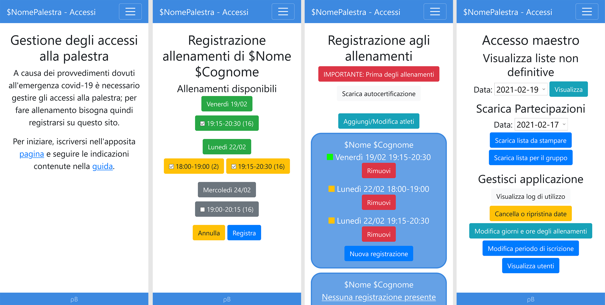
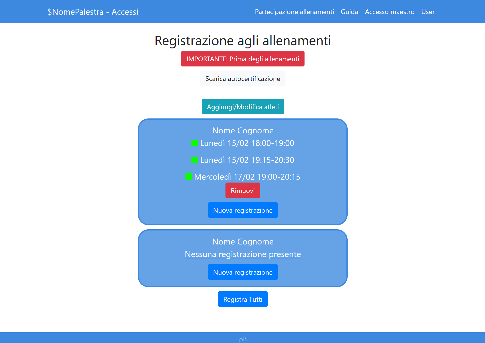

[English version](README-en.md)
# Accessi palestra
Questo progetto è stato sviluppato per monitorare gli accessi a una palestra di arti marziali durante la pandemia dovuta al Covid-19. Offre funzioni di:

* Iscrizione e modifica utenti
* Registrazione di atleti
* Prenotazione degli allenamenti
* Gestione delle date e degli orari di allenamento
* Generazione delle liste di partecipazione

L'applicazione consiste in un sito internet che permette la registrazione degli utenti evitando ai gestori eccessive interazioni per gestire le partecipazioni.

## Struttura dell'applicazione
Il sito si compone di quattro sezioni raggiungibili dal menu principale.

### Partecipazione allenamenti
Permette di aggiungere e rimuovere atleti, prenotare e disdire allenamenti. Al fine di massimizzare il numero di persone diverse che partecipano agli allenamenti di una giornata, in caso di N iscrizioni multiple in un giorno per lo stesso atleta il sistema ne garantisce una sola, con una probabilità partecipazione di 1/N. Se necessario, le prenotazioni a probabilità più bassa verranno riallocate ad altri atleti (ricalcolando le loro probabilità), mentre, in caso di sufficienti posti liberi, verranno concesse anche le altre iscrizioni.

### Guida
Spiega agli utenti quali utilizzi permette l'applicazione; in base allo stato dell'utente (visitatore, utente, maestro) mostra sezioni aggiuntive.

### Accesso maestro
Sezione amministrativa dell'applicazione, permette di:
* Visualizzare e scaricare le liste di partecipazione
* Visualizzare i log di utilizzo
* Gestire date e orari di allenamento e di chiusura
* Gestire i permessi degli utenti

### Profilo
Gestione di nome utente e password.

## Sistema
### Requisiti
Il sistema originale consiste nei seguenti elementi:
|                      |                  |
| -------------------- | ---------------- |
| Hardware             | Raspberry Pi 3b+ |
| Sistema Operativo    | Raspbian Linux 9 |
| Web Server           | Apache 2.4.25    |
| DBMS                 | MariaDB 10.1.48  |

### Linguaggi e librerie
| Software                               | Versione |
| -------------------------------------- | -------- |
| [PHP](https://www.php.net/)            | 7.2      |
| [Bootstrap](https://getbootstrap.com/) | 4.4.1    |
| [Jquery](https://jquery.com/)          | 3.5.1    |
| [FPDF](http://www.fpdf.org/)           | 1.82     |

Ulteriori informazioni per il deploy sono inserite nei README per il [database](database/README.md) e per il [codice sorgente](src/README.md).

## Autori
[@rb-sl](https://github.com/rb-sl)

## Licenza
Questa applicazione è rilasciata con [licenza Apache 2.0](LICENSE).

## Immagini

