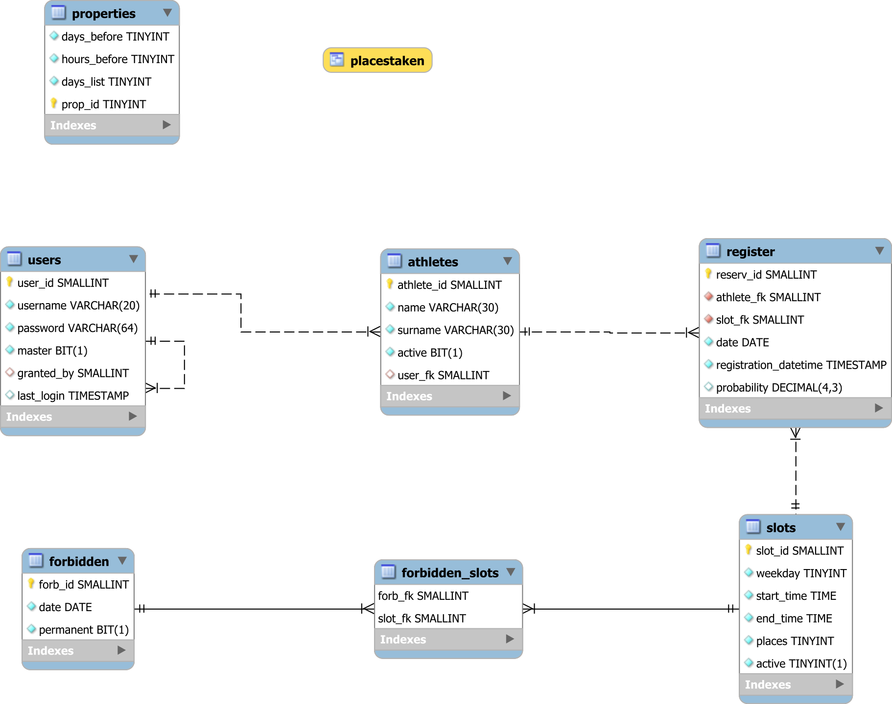

# Application's Database

## ER Model description


### Users
The table `users` contains information about users registered to the application. Its fields are: 
* `user_id`: User identifier (PK)
* `username`: Name chosen by the user (Unique)
* `password`: Password chosen by the user, saved as hash MD5
* `master`: Flag, identifies user with Master Access privileges
* `granted_by`: Foreign key, referred to the user who granted privileges
* `last_login`: Access timestamp

The attribute `granted_by` is used to build a tree to know the privilege grants. It allows users to remove the Master Access only to those that appear in their subtree.

### Athletes
The table `athletes` contains athletes registered by users and their data:
* `athlete_id`: Identifier (PK)
* `name`: The athlete's name
* `surname`: The athlete's surname
* `active`: Flag, set to 1 by default, 0 if the athlete is deleted
* `user_fk`: Foreign key, references the user that created the athlete

The `active` flag allows the application to hide the athlete to the user while maintaining their information for the history of participations.

### Register
The table `register` represents the athlete's registration to training sessions. It contains:
* `reserv_id`: Registration identifier (PK)
* `athlete_fk`: Reference to the athlete connected to the registration 
* `slot_fk`: Reference to the selected slot
* `date`: Date of the selected training session
* `registration_datetime`: Timestamp of creation of the tuple
* `probability`: Value between 0 and 1

The value of `probability` is useful to handle the mechanism to assign places, so that lowest probability places can get reassigned to allow more people to participate in a day. At the end of the registration period, as many registrations as possible have their probability brought to 1, so to maximize the overall number of people. 

### Slots
The table `slots` contains information about days and times of training sessions:
* `slot_id`: Identifier (PK)
* `weekday`: Weekday of the slot
* `start_time`: Start time of the training slot
* `end_time`: End time of the training slot
* `places`: Maximum number of athletes that can participate at the session
* `active`: Flag indicating if a slot is available

As in the `athletes` table, `active = 0` allows to hide the slot without losing information about the past sessions.

### Forbidden
The table `forbidden` contains dates that cannot host training sessions.
* `forb_id`: Data identifier (PK)
* `date`: The removed date
* `permanent`: Flag used to indicate if the date is removed every year (1) or only once (0)

### Forbidden Slots
The table `forbidden_slots` represents the bridge between `slots` and `forbidden`, to indicate which slots in which date must not be shown to users. It only contains the foreign keys for the two tables.

### Properties
The table `properties` contains some properties of the system inside only one tuple. Even if not properly part of the relational model, it is added to take advantage of the concurrency control of the DBMS. The properties are:
* `days_before`: Number of days before a training session in which it can be reserved
* `hours_before`: Number of hours before the session at which the registration period ends
* `days_list`: Number of previous days of which to show the participation lists
* `prop_id`: Identifier of the only tuple (PK)

### Placestaken
The view `placestaken` helps in knowing the number of places already occupied for each date; old dates are kept in the view as well. Its creation is performed by the query
```
SELECT slot_fk, date, FLOOR((ROUND((SUM(probability) * 100),0) / 100)) AS taken 
FROM register 
GROUP BY slot_fk, date
```

## Triggers
In order to maintain some properties of the database the following triggers are defined:
* `GRANTER_INSERT` and `GRANTER_UPDATE`: Control the relationships between masters and their granted_by; they do not update the fields if the granter or the tuple are not masters but `granted_by` is set
* `PROP_COUNT` and `PROP_ABORT_DELETE`: Maintain the only tuple in `properties`
* `PROP_DAYS_BEFORE`: Saturates the maximum number of open days before the session at 7

## Creation of a new database instance
The database structure is described in the file [accessi_palestra.sql](accessi_palestra.sql). The code already contains a tuple for properties, set as
* `days_before`: 7
* `hours_before`: 3
* `days_list`: 30

Modify at row `237` `$USER` and `$PASSWORD` with the chosen values to create the first user with Master Access.  

To create the database it is sufficient to import the `.sql` file into the MySQL client.