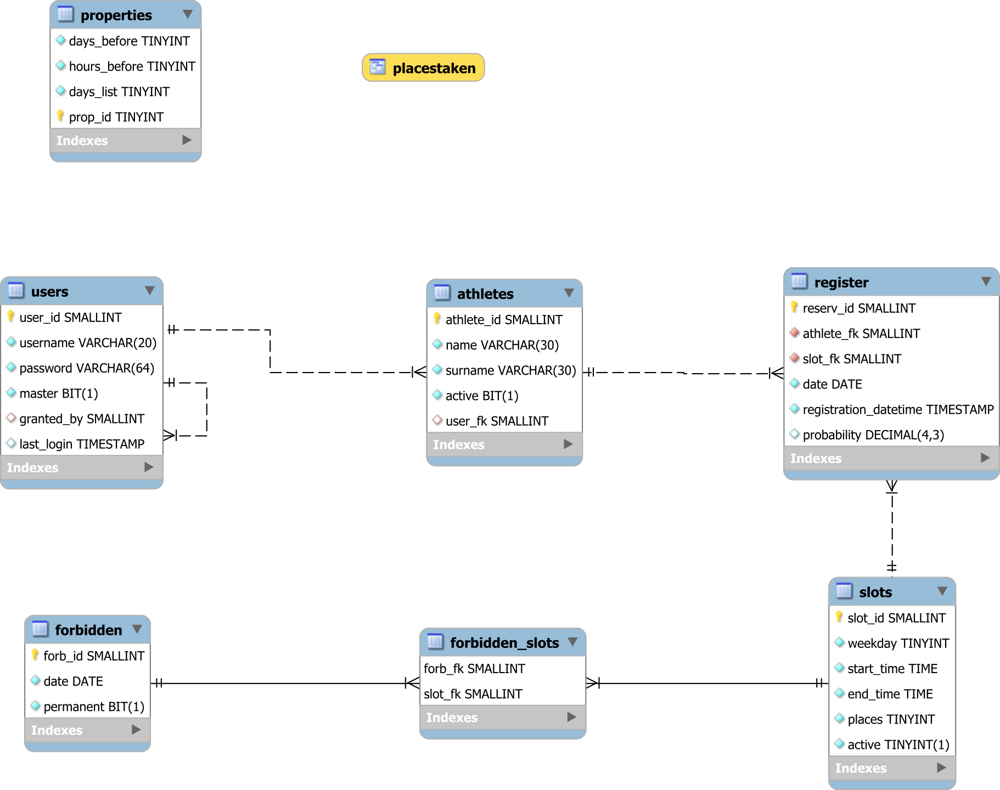

[English version](README-en.md)
# Database dell'applicazione

## Descrizione del modello


### Users
La tabella `users` contiene informazioni riguardo agli utenti iscritti all'applicazione. I campi sono:
* `user_id`: Identificativo dell'utente (PK)
* `username`: Nome scelto dall'utente (Unique)
* `password`: Password scelta dall'utente, salvata come hash MD5
* `master`: Identifica gli utenti con accesso maestro
* `granted_by`: Chiave esterna, si riferisce all'utente che ha concesso i privilegi di accesso
* `last_login`: Timestamp di accesso

Attraverso l'attributo `granted_by` viene costruito un albero utile a ricostruire la concessione dei privilegi. Viene utilizzato per permettere la revoca a un utente solo se si trova nel proprio sottoalbero di concessioni.

### Athletes
La tabella `athletes` contiene gli atleti registrati dagli utenti e le loro informazioni:
* `athlete_id`: Identificativo (PK)
* `name`: Nome dell'atleta
* `surname`: Cognome dell'atleta
* `active`: Flag settato a 1 di default, 0 se viene cancellato
* `user_fk`: Chiave esterna con riferimento all'utente che ha creato l'atleta

Il flag `active` permette di non mostrare all'utente l'atleta eliminato, mantenendo però le sue informazioni per gli storici di partecipazione.

### Register
La tabella `register` rappresenta le registrazioni degli atleti agli allenamenti. Contiene:
* `reserv_id`: Identificativo della registrazione (PK)
* `athlete_fk`: Riferimento all'atleta per cui è stata effettuata la registrazione 
* `slot_fk`: Riferimento allo slot di allenamento selezionato
* `date`: Data dell'allenamento selezionato
* `registration_datetime`: Timestamp di creazione della registrazione
* `probability`: Valore compreso tra 0 e 1

Il valore di `probability` è utile per gestire il meccanismo di assegnazione dei posti, così da permettere a più persone diverse di fare allenamento riassegnando i posti a probabilità più bassa e prenotati più recentemente. Alla fine del periodo di iscrizione il maggior numero possibile di registrazioni viene portato a 1.

### Slots
La tabella `slots` contiene le informazioni su giorni e orari disponibili per gli allenamenti:
* `slot_id`: Identificativo (PK)
* `weekday`: Giorno della settimana dello slot
* `start_time`: Orario di inizio dello slot di allenamento
* `end_time`: Orario di fine dello slot di allenamento
* `places`: Numero massimo di atleti che possono partecipare nello slot
* `active`: Flag che indica se un allenamento è disponibile

Come nella tabella `athletes`, `active = 0` permette di nascondere lo slot senza perdere informazioni relative ad allenamenti passati, nel caso si desideri rimuoverlo.

### Forbidden
La tabella `forbidden` contiene le date che non possono ospitare allenamenti:
* `forb_id`: Identificativo della data (PK)
* `date`: Data rimossa
* `permanent`: Flag, se uguale a 1 indica che la data è rimossa ogni anno, 0 solo nell'anno indicato

### Forbidden Slots
La tabella `forbidden_slots` rappresenta la funzione di ponte per modellare la relazione tra `slots` e `forbidden`, per indicare quali slot e in quale data non devono essere presentati all'utente; contiene solo le chiavi esterne delle due tabelle.

### Properties
La tabella `properties` contiene alcune proprietà del sistema in una sola tupla; seppure non propriamente parte del database relazionale, è stata inserita per sfruttare la gestione della concorrenza da parte del DBMS, dato che queste  proprietà possono essere aggiornate:
* `days_before`: Numero di giorni prima di un allenamento per cui vengono aperte le iscrizioni
* `hours_before`: Numero di ore prima dell'allenamento a cui vengono chiuse le iscrizioni
* `days_list`: Numero di giorni precedenti di cui mostrare le liste di partecipazione
* `prop_id`: Identificativo dell'unica tupla (PK)

### Placestaken
La vista `placestaken` serve a conoscere il numero di posti occupati per ogni data; vengono mantenute anche le date precedenti in vista di una possibile espansione statistica. La sua creazione avviene tramite la query
```
SELECT slot_fk, date, FLOOR((ROUND((SUM(probability) * 100),0) / 100)) AS taken 
FROM register 
GROUP BY slot_fk, date
```

## Trigger
Al fine di mantenere alcune proprietà del database sono definiti i seguenti trigger:
* `GRANTER_INSERT` e `GRANTER_UPDATE`: mantengono le relazioni tra master e granted_by, e annullano le modifiche se il granter o la tupla selezionata non sono master ma risulta settato l'attributo `granted_by`
* `PROP_COUNT` e `PROP_ABORT_DELETE`: servono a mantenere una sola tupla all'interno di `properties`
* `PROP_DAYS_BEFORE`: satura il numero massimo di giorni di apertura delle iscrizioni a 7.


## Creazione di una nuova istanza del database
La struttura del database è esportata nel file [accessi_palestra.sql](accessi_palestra.sql). Il codice contiene già una tupla per le proprietà, impostate di default a:
* `days_before`: 7
* `hours_before`: 3
* `days_list`: 30

Modificare alla riga `237` `$USER` e `$PASSWORD` con valori a scelta, per creare il primo utente con accesso maestro.  

Per creare il database è sufficiente importare il file `.sql` nel DBMS MySQL.