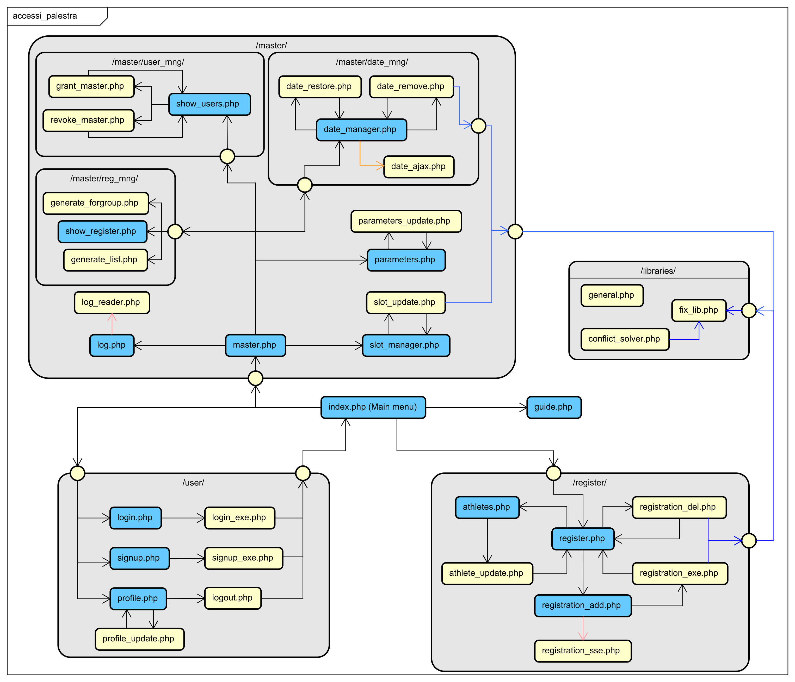

# Source code
This folder and its subfolders contain the source code of the application; file descriptions are written as comments inside the files themselves.

## Server configuration for the deployment
In order for the application to work correctly, the root (represented by this folder) must be associated to a web server (e.g. Apache); in a LAMP system the files can be stored in `/var/www`.

## Files to be added or modified

### server_conf.json
A file `server_conf.json`, containing system information, must be stored in a folder not accessible to the server. It must follow the following format:
```
{
    "dbuser": "$USERNAME",
    "dbpass": "$PASSWORD",
    "dbname": "accessi_palestra"
}
```
With the correct credentials.

### [general.php](libraries/general.php)
This file contains the main information of the application and must be adapted to the context. Some constants need modifications:

* `5 - CONF_PATH`: Path to `server_conf.json`
* `6 - LOG_PATH`: Folder where the application logs will be stored
* `9 - BOOTSTRAP_CSS_PATH`: Path to the Bootstrap css source file
* `10 - BOOTSTRAP_JS_PATH`: Path to the Bootstrap JavaScript source file
* `11 - JQUERY_PATH`: Path to the jQuery source file
* `12 - FPDF_ROOT`: Root folder of FPDF
* `14 - AUTOCERT_PATH`: Path to the pdf file containing the self-certification to be printed
* `15 - DISPLAY_NAME`: Name of the gym (Shown in the browser tab and in the main menu)

### [generate_list.php](master/reg_mng/generate_list.php)
The participation list generation file needs modifications at lines `72-81`, that represent information about masters; if necessary they can be replicated to add more.

### Cron job
A Cron Job is necessary for the script `conflict_solver.php`. Its form is
```
2,17,32,47 * * * * sudo /usr/bin/php7.0 /var/www/accessi_palestra/libraries/conflict_solver.php
```
i.e., 2 minutes after the closing time, every day. It can be refined to run only on days with training sessions.

## Site structure


The image shows the structure of php scripts. Blue pages offer an interaction to the user, while arrows are color coded as:
* Black: Normal transition
* Blue: Inclusion relation
* Orange: External call through JavaScript

Inclusions of `general.php` are omitted, as it is used in all pages (except `fix_lib.php`).